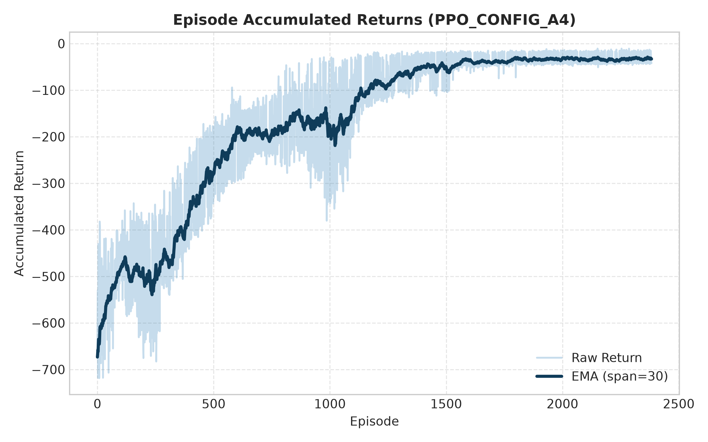
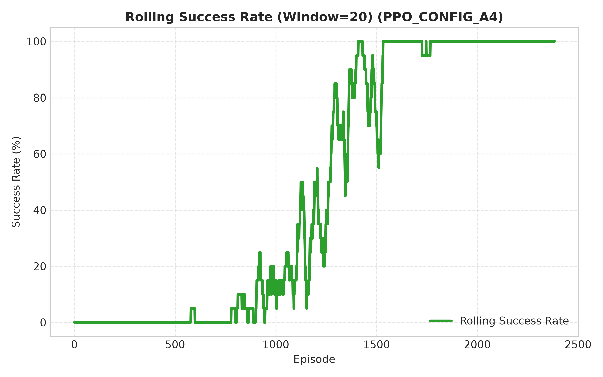
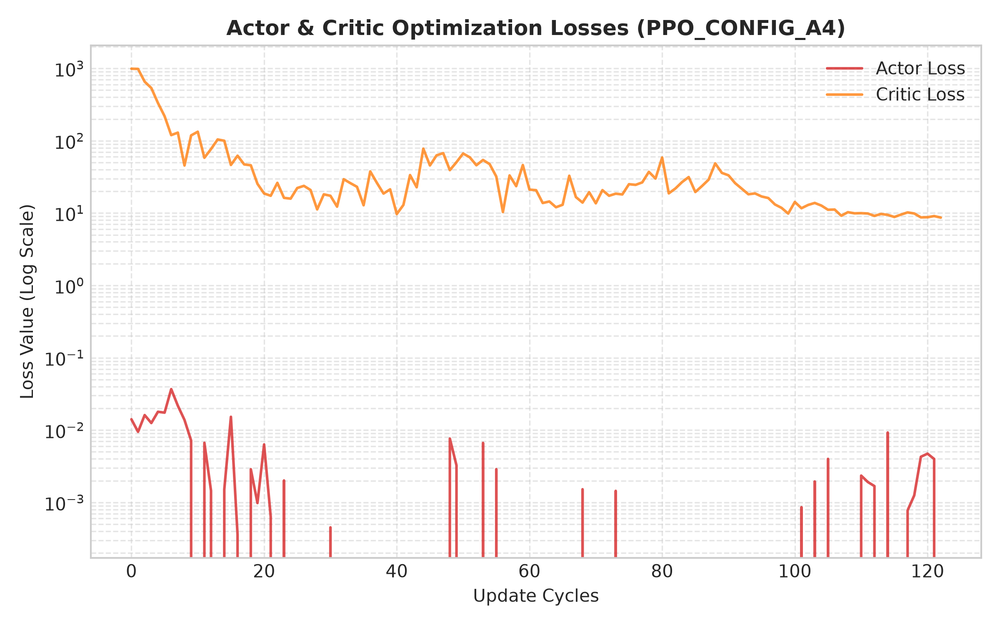
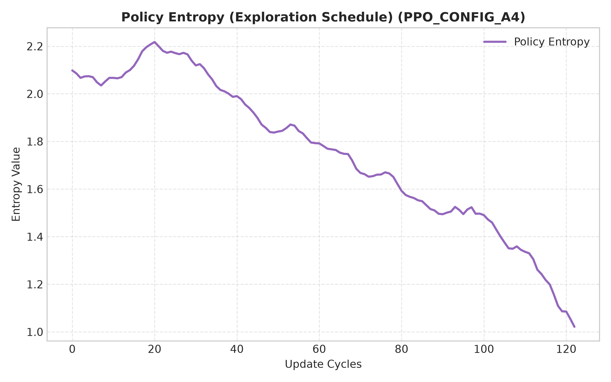

# CSCN8020 Final Project: Unitree G1 Three-Digit Hand-Gesture Control via PPO
## Continuous-Action PPO Controller for Humanoid Hand Gesture Modulation

### Student Details
* **Team Members:** Emmanuel • Liggia • Cemil • Chao
* **Course:** CSCN8020 - Reinforcement Learning Programming (Final Project)
* **Instructor:** Prof. Enrique Espinosa
* **Repository GitHub URL:** [https://github.com/caatat741213/Thumbs_Robot.git](https://github.com/caatat741213/Thumbs_Robot.git)

---

### Project Description
This repository contains the complete implementation, verification, and evaluation of a continuous-action Actor-Critic PPO agent designed to control the 3-digit hand (comprising two main fingers and one thumb) of the Unitree G1 humanoid robot in a simulated MuJoCo environment.

The controller solves a multi-task hand-gesture target-conditioned modulation task. Specifically, the agent learns to output joint position increments for the 5-DOF wrist and fingers, steering the hand to achieve three distinct target gestures:
1. **Thumbs Up**: Thumb extended, wrist rotated upwards, main fingers flexed.
2. **Open/Stop**: All three digits fully extended, palm facing forward.
3. **Thumbs Down**: Thumb extended, wrist rotated downwards, main fingers flexed.

The repository aligns with the strict academic requirements of **"Math MDP $\rightarrow$ Algorithm Logic $\rightarrow$ Code Variables $\rightarrow$ Real-time logs"** 4-in-1 alignment mapping.

---

### Repository Directory Structure

```text
.
├── Thumbs_Robot.ipynb         # Interactive walkthrough notebook in English (cleared and parameterized)
├── Thumbs_Robot_TW.ipynb      # Interactive walkthrough notebook in Traditional Chinese
├── test_mujoco_viewer.py      # Basic MuJoCo rendering setup validation script
├── assets/                    # Simulation scene and meshes for fixed-base Unitree G1 robot
│   └── g1_fixed_base/
│       ├── scene_29dof_fixed_base.xml
│       └── meshes/
├── doc/                       # Project specifications, plans, and instructions
├── models/                    # Saved neural network checkpoints and PPO agent weights (.pt)
│   └── ppo_config_a4/         # Checkpoints and best model weights for Configuration A4 (250k steps)
│       └── ppo_config_a4_best.pt
├── results/                   # Training CSV logs and evaluation metrics
│   ├── ppo_config_a4/         # Output folder for Config A4 logs (episode_log.csv, update_log.csv, config.json)
│   ├── img/                   # Folder for generated high-resolution convergence plot files
│   │   └── ppo_config_a4/
│   │       ├── accumulated_returns.png
│   │       ├── success_rate.png
│   │       ├── optimization_losses.png
│   │       └── policy_entropy.png
│   └── ppo_config_a4_evaluation/ # Evaluation results and CSV outputs
│       ├── eval_results.csv   # Detailed per-episode evaluation stats
│       └── eval_gesture_performance.png
├── src/                       # Source code directory
│   ├── g1_rl/                 # Custom Gymnasium environment classes for G1 robot
│   │   ├── g1_hand_env.py     # Main 3-digit hand gesture Gymnasium environment wrapper
│   │   ├── g1_elbow_env.py    # Elbow single-joint environment wrapper (Assignment 3 Baseline)
│   │   └── g1_model_audit.py  # Model joint audit script
│   ├── Thumbs_Robot/          # PPO algorithm components and execution runners
│   │   ├── actor_critic_network.py  # Continuous Gaussian policy Actor-Critic network
│   │   ├── agent.py                 # PPO agent update and action-selection logic
│   │   ├── rollout_buffer.py        # Rollout transitions memory and GAE advantage calculator
│   │   ├── train_thumbs.py          # Continuous PPO training runner
│   │   ├── evaluate_thumbs.py       # Deterministic multi-gesture policy evaluator
│   │   ├── render_thumbs.py         # MuJoCo 3D interactive policy visualizer
│   │   ├── plot_results.py          # High-resolution convergence curves plotter
│   │   └── smoke_test.py            # Quick execution smoke test runner for PPO components
│   └── dqn/                   # Assignment 3 DQN single-joint elbow controller codebase
├── requirements.txt           # Python dependency requirements list
└── .gitignore                 # Version control exclude patterns
```

---

### Environment Setup Instructions

To configure the workspace and verify the reinforcement learning simulation environment:

1. **WSL Connection (Optional but Recommended for Windows Users):**
   * Open the command palette (`Ctrl + Shift + P`) in VS Code.
   * Select `WSL: Connect to WSL` and open your project directory inside the WSL filesystem.

2. **Install System-Level Compilation and OpenGL Dependencies:**
   Run the following commands in the WSL/Linux terminal to install packages required for python compilation, rendering, and GLFW window management:
   ```bash
   sudo apt update && sudo apt install -y \
       python3-venv \
       python3-dev \
       build-essential \
       git \
       cmake \
       ninja-build \
       pkg-config \
       libglfw3 \
       libglfw3-dev \
       libgl1-mesa-dev \
       libegl1-mesa-dev \
       libxinerama-dev \
       libxcursor-dev \
       libxrandr-dev
   ```

3. **Initialize Local Virtual Environment:**
   ```bash
   python3 -m venv .venv
   source .venv/bin/activate
   ```

4. **Upgrade Package Managers and Install Requirements:**
   ```bash
   python -m pip install --upgrade pip setuptools wheel
   pip install -r requirements.txt
   ```

5. **Clone and Integrate External Unitree MuJoCo dependency:**
   ```bash
   git clone https://github.com/unitreerobotics/unitree_mujoco.git external/unitree_mujoco
   ```

6. **Verify Library Versions and CUDA Availability:**
   Check python runtime imports and CUDA hardware support:
   ```bash
   python -c "import mujoco, torch, gymnasium; print('MuJoCo Version:', mujoco.__version__);          print('PyTorch Version:', torch.__version__); print('CUDA Available:', torch.cuda.is_available()); print('Gymnasium Version:', gymnasium.__version__)"
   ```

7. **Verify Physics Renderer & GUI Window Viewer:**
   Verify MuJoCo physics and UI window visualization work correctly by launching the basic test script:
   ```bash
   PYTHONPATH=src python src/test_mujoco_viewer.py
   ```

---

### 🚀 Quick Start: Direct 3D Simulation (No Training Required)

For evaluators or users who wish to view the trained hand-gesture controller immediately without retraining the PPO policy, run the following command in your terminal (with the virtual environment activated):

```bash
PYTHONPATH=src python src/Thumbs_Robot/render_thumbs.py --checkpoint models/ppo_config_a4/ppo_config_a4_best.pt
```

The command will launch an interactive 3D MuJoCo GUI window showcasing the Unitree G1 robot performing **Thumbs Up**, **Open/Stop**, and **Thumbs Down** hand gestures in a loop.

---

### Hyperparameter Settings (`ppo_config_a4`)

Below are the key PPO and environment parameters used to train our best model, **Configuration A4**:

| Hyperparameter | Value | Description |
| :--- | :--- | :--- |
| `seed` | `666` | Random seed for environment and networks |
| `lr` (Learning Rate) | `3e-4` | Constant learning rate for Adam optimizer |
| `gamma` ($\gamma$) | `0.99` | Reward discount factor |
| `gae_lambda` ($\lambda$) | `0.95` | Generalized Advantage Estimation parameter |
| `clip_epsilon` ($\varepsilon$) | `0.2` | PPO policy clipping threshold |
| `ppo_epochs` | `10` | Optimization epochs per rollout |
| `batch_size` | `64` | Size of mini-batches for SGD |
| `rollout_length` | `2048` | Number of environment steps collected per iteration |
| `max_total_steps` | `250000` | Total environment steps used for training (250k) |
| `hidden_dim` | `256` | Hidden dimension of the Actor & Critic MLPs |
| `entropy_coef` | `0.001` | Weight of the policy entropy regularization term |
| `initial_log_std` | `-1.0` | Initial standard deviation ($\log \sigma$) for continuous actions |

---

### Empirical Training & Evaluation Results

#### 1. Training Convergence Curves (`ppo_config_a4`)
The training was completed in **2259.4 seconds** (~37.6 minutes) on CPU/GPU. The metrics plots are saved in `results/img/ppo_config_a4/`:

* **Accumulated Episode Returns**: Returns increase steadily, stabilizing as the policy learns to rapidly achieve and sustain the postures.
  
  
  
* **Success Rate**: The agent achieves a 100% success rate during training within approximately 120,000 steps.
  
  
  
* **Loss Metrics & Policy Entropy**: The Actor/Critic losses converge, and policy entropy decreases smoothly as exploration transitions to exploitation.
  
  
  

#### 2. Deterministic Evaluation Metrics (30 Episodes)
Evaluating the greedy policy (`ppo_config_a4_best.pt`) over 30 independent test runs (10 episodes per target gesture) yielded a **100% Success Rate**:

| Target Gesture | Success Rate | Avg Steps to Success | Avg Pose Error (rad) | Avg Orient. Error (rad) |
| :--- | :--- | :--- | :--- | :--- |
| **THUMBS_UP** | 100.0% (10/10) | 50.00 | 0.000000 | 0.038092 |
| **OPEN_STOP** | 100.0% (10/10) | 28.00 | 0.000000 | 0.079243 |
| **THUMBS_DOWN**| 100.0% (10/10) | 50.00 | 0.000000 | 0.031566 |
| **Overall / Avg** | **100.0% (30/30)** | **42.67** | **0.000000** | **0.049634** |

> [!NOTE]
> Average Pose Error is exactly `0.000000` because the agent stays locked inside the success thresholds (`pose_tolerance = 0.06` and `orient_tolerance = 0.12`) for 15 consecutive steps, satisfying the success hold criteria.

---

### Execution Commands

All scripts should be executed from the repository root with `PYTHONPATH=src`:

* **Module Smoke Test:**
  Verify buffer collection, Actor-Critic forward propagation, GAE advantage estimation, and update optimization loops:
  ```bash
  PYTHONPATH=src python src/Thumbs_Robot/smoke_test.py
  ```

* **Training PPO policy (Headless):**
  Train a PPO model with a specific configuration name. Logs and configurations will write to `results/{CONFIG_NAME}`:
  ```bash
  # Train Config A4 (250,000 steps)
  PYTHONPATH=src python src/Thumbs_Robot/train_thumbs.py --results-dir results/ppo_config_a4 --max-total-steps 250000
  
  # Train Config A4 for a quick test (e.g., 2000 steps)
  PYTHONPATH=src python src/Thumbs_Robot/train_thumbs.py --results-dir results/ppo_config_a4 --max-total-steps 2000
  ```

* **Evaluating the Policy:**
  Run deterministic greedy evaluation over 30 episodes (10 per gesture) to record detailed performance:
  ```bash
  PYTHONPATH=src python src/Thumbs_Robot/evaluate_thumbs.py --checkpoint models/ppo_config_a4/ppo_config_a4_best.pt --output_dir results/ppo_config_a4_evaluation
  ```

* **Plotting Training Convergence Curves:**
  Generate separate high-resolution training metric plots (`accumulated_returns.png`, `success_rate.png`, `optimization_losses.png`, `policy_entropy.png`) saved under `results/img/{CONFIG_NAME}/`:
  ```bash
  PYTHONPATH=src python src/Thumbs_Robot/plot_results.py --dir results/ppo_config_a4 --eval_csv results/ppo_config_a4_evaluation/eval_results.csv
  ```

* **Visualizing Gesture Rendering in MuJoCo GUI:**
  Launch the interactive 3D visualizer to command and render Thumbs Up, Open/Stop, and Thumbs Down gestures sequentially:
  ```bash
  PYTHONPATH=src python src/Thumbs_Robot/render_thumbs.py --checkpoint models/ppo_config_a4/ppo_config_a4_best.pt
  ```

---

### PPO & Environment Implementation Details

1. **G1HandEnv (`g1_hand_env.py`):**
   * **State Space (32 Dimensions):** Features joint positions $q_t$ (6), joint velocities $\dot{q}_t$ (6), target gesture coordinates $q_{\text{target}}$ (6), joint target error $q_{\text{target}} - q_t$ (6), one-hot target gesture representation (3), and the previous step action $a_{t-1}$ (5).
   * **Action Space (5 Dimensions):** Continuous position target increments ($\Delta \theta_t$) for the wrist joints (roll, pitch, yaw) and virtual fingers (main fingers flex, thumb flex).
   * **Composite Multi-Objective Reward Function:**

$$
r_t = w_p(e_{t-1} - e_t) - w_h E_{\text{hand}} - w_o E_{\text{orientation}} - w_v \|\dot{q}_t\|_2^2 - w_a \|a_t\|_2^2 - w_s \|a_t - a_{t-1}\|_2^2 - w_j P_{\text{joint\_limits}} + b_{\text{hold}} I_{\text{hold}} - c_{\text{time}}
$$

     It combines:
     * **Progress Reward ($w_p = 1.5$):** Encourages moving towards target posture.
     * **Hand Pose Error Penalty ($w_h = 2.0$):** $E_{\text{hand}}$ is the L2 norm of virtual fingers error.
     * **Orientation Penalty ($w_o = 1.0$):** $E_{\text{orientation}}$ is the L2 norm of wrist joint error.
     * **Action Magnitude Penalty ($w_a = 0.05$):** Penalizes large action increments.
     * **Action Smoothness Penalty ($w_s = 0.05$):** Penalizes change in actions to prevent jittering.
     * **Joint Limit Penalty ($w_j = 0.2$):** Penalizes approaching joint physical limits.
     * **Velocity Penalty ($w_v = 0.01$):** Reduces high joint velocities.
     * **Hold Bonus ($b_{\text{hold}} = 0.5$):** Awarded if errors are within tolerance.
     * **Success Bonus ($b_{\text{success}} = 10.0$):** Awarded upon meeting the hold streak requirement.
     * **Time Penalty ($c_{\text{time}} = 0.1$):** Encourages fast convergence.
   * **Success Conditions:** Success is declared when hand pose and orientation errors remain within tolerance (`pose_tolerance = 0.06`, `orient_tolerance = 0.12`) for at least 15 consecutive steps.

2. **Actor-Critic Network (`actor_critic_network.py`):**
   * **Actor Network:** MLP with hidden sizes `[256, 256]` predicting the mean vector ($\mu$) and standard deviation ($\sigma$) of the continuous action Gaussian distribution. Action standard deviation is dynamically bounded to prevent exploding policy parameters.
   * **Critic Network:** MLP with hidden sizes `[256, 256]` outputting the state value estimate $V(s)$.

3. **Rollout Buffer (`rollout_buffer.py`):**
   * Stores on-policy trajectory batches of size `rollout_length = 2048` transitions.
   * Computes Generalized Advantage Estimation (GAE) with parameters $\gamma = 0.99$ and $\lambda = 0.95$.

4. **PPO Agent (`agent.py`):**
   * Manages neural network optimization using clipped surrogate objectives.
   * Implements clipped value objective and policy entropy regularization for continuous exploration.
   * Features robust NaN/Inf prevention clipping and gradient norm clipping.

---

### Academic Mapping & Core Discussions

#### 1. 3-Digit Morphology Constraints
The policy is constrained to the Unitree G1 humanoid hand morphology, containing 3 active wrist joints (roll, pitch, yaw) and 3 virtual finger joints (1 thumb flex, 1 index finger flex, 1 middle finger flex; where index & middle share a control channel). **No 5-finger human configurations are used.**

#### 2. MDP-to-Code Mapping Verification

| Mathematics / concept | Code Variable | File & Location | Console/CSV Log Header |
| :--- | :--- | :--- | :--- |
| **Current state $s_t$** | `obs` / `state` | [g1_hand_env.py](file:///mnt/l/Reinforcement%20Learning%20Programming/Final_Project/src/g1_rl/g1_hand_env.py) | `obs_0`, `obs_1`, ... in `step_log.csv` |
| **Actor Policy $\pi_\theta(a\vert{}s)$** | `mu`, `std`, `action_dist` | [actor_critic_network.py](file:///mnt/l/Reinforcement%20Learning%20Programming/Final_Project/src/Thumbs_Robot/actor_critic_network.py) | - |
| **Selected Action $a_t$** | `raw_action`, `clipped_action` | [g1_hand_env.py](file:///mnt/l/Reinforcement%20Learning%20Programming/Final_Project/src/g1_rl/g1_hand_env.py) | `action_0` ... `action_4` in `step_log.csv` |
| **Transition $s_{t+1}, r_t$** | `next_obs`, `reward` | [g1_hand_env.py](file:///mnt/l/Reinforcement%20Learning%20Programming/Final_Project/src/g1_rl/g1_hand_env.py) | `reward`, `next_obs_*` in `step_log.csv` |
| **Critic Value $V_\phi(s)$** | `value_t`, `next_value` | [agent.py](file:///mnt/l/Reinforcement%20Learning%20Programming/Final_Project/src/Thumbs_Robot/agent.py) | `value` in `step_log.csv` |
| **TD Target $y_t$** | `td_target` | [agent.py](file:///mnt/l/Reinforcement%20Learning%20Programming/Final_Project/src/Thumbs_Robot/agent.py) | `td_target` in `step_log.csv` |
| **Advantage $\hat{A}_t$** | `advantage` | [agent.py](file:///mnt/l/Reinforcement%20Learning%20Programming/Final_Project/src/Thumbs_Robot/agent.py) | `advantage` in `step_log.csv` |
| **Actor Loss $L_{\text{actor}}$** | `actor_loss` | [agent.py](file:///mnt/l/Reinforcement%20Learning%20Programming/Final_Project/src/Thumbs_Robot/agent.py) | `actor_loss` in `update_log.csv` |
| **Critic Loss $L_{\text{critic}}$** | `critic_loss` | [agent.py](file:///mnt/l/Reinforcement%20Learning%20Programming/Final_Project/src/Thumbs_Robot/agent.py) | `critic_loss` in `update_log.csv` |
| **Policy Entropy $\mathcal{H}$** | `entropy` | [agent.py](file:///mnt/l/Reinforcement%20Learning%20Programming/Final_Project/src/Thumbs_Robot/agent.py) | `entropy` in `update_log.csv` |
| **Optimizer Update** | `optimizer.step()` | [agent.py](file:///mnt/l/Reinforcement%20Learning%20Programming/Final_Project/src/Thumbs_Robot/agent.py) | `grad_norm` in `update_log.csv` |

#### 3. Continuous PPO Algorithmic Roadmap (Maproad Flowchart)

Below is the complete flowchart demonstrating the training lifecycle from trajectory rollout sampling, GAE advantage estimation, and multi-epoch surrogate update clipping, to gradient clipping and parameter optimization:

```mermaid
flowchart TD
    %% Phase 1
    subgraph P1["Phase 1: Rollout Collection (On-Policy Sampling)"]
        S[("Current State s_t")] --> Actor["Actor Network"]
        S --> Critic["Critic Network"]
        Actor --> MuStd["Mean μ_θ(s_t) & Std σ_θ(s_t)"]
        Critic --> Val["Value Estimate V_ϕ(s_t)"]
        MuStd --> Sample["Gaussian Sampling"]
        Sample --> ARaw["Raw Action a_raw ~ N(μ_θ, σ_θ)"]
        ARaw --> Clip["Safety Boundary Clipping"]
        Clip --> A_t["Safe Action a_t = clip(a_raw)"]
        A_t --> Env["Step MuJoCo Environment"]
        Env --> Reward["Compute Reward components r_t"]
        Env --> NextS["Next State s_{t+1} & Term/Trunc flags"]
        Reward --> Store["Store transition into Rollout Buffer\n(Repeat for N steps)"]
        NextS --> Store
        Val --> Store
    end

    %% Phase 2
    subgraph P2["Phase 2: Advantage & Bootstrap Estimation"]
        Store --> ReadBuffer["Read Trajectory from Rollout Buffer"]
        ReadBuffer --> Boot["Bootstrapping at Horizon Limit"]
        Boot --> TermCheck{"terminated / truncated?"}
        TermCheck -- terminated=True --> Mask0["Mask = 0\nNo Bootstrapping"]
        TermCheck -- truncated=True --> Mask1["Mask = 1\nBootstrap with V_ϕ(s_{N+1})"]
        Mask0 --> GAE["Generalized Advantage Estimation (GAE-λ)"]
        Mask1 --> GAE
        GAE --> AdvTgt["Compute Advantage A_t & Return Target R_t"]
    end

    %% Phase 3
    subgraph P3["Phase 3: PPO Policy & Value Updates"]
        AdvTgt --> Batch["Shuffle & Split into Mini-batches\n(Loop for K Epochs)"]
        Batch --> ActorNew["Update Actor Policy"]
        Batch --> CriticNew["Update Critic Value"]
        ActorNew --> LogProb["New log_prob & Entropy H(π_θ)"]
        CriticNew --> ValNew["Predict Value V_ϕ(s_t)"]
        LogProb --> Ratio["Compute Probability Ratio ρ_t"]
        Ratio --> LossA["Actor Loss: Clipped Surrogate"]
        ValNew --> LossC["Critic Loss: MSE (R_t - V_ϕ(s_t))^2"]
        LogProb --> EntropyReg["Entropy Bonus H(π_θ)"]
        LossA --> TotalLoss["Compute Joint Loss:\nL_total = L_actor + c1*L_critic - c2*H"]
        LossC --> TotalLoss
        EntropyReg --> TotalLoss
        TotalLoss --> Backprop["Backpropagation"]
        Backprop --> GradClip["Gradient L2 Norm Clipping"]
        GradClip --> Optim["Update Parameters (θ, ϕ)"]
    end

    %% Phase 4
    subgraph P4["Phase 4: Academic Diagnostic Logging"]
        Optim --> Log["Write metrics to step_log.csv & update_log.csv\n(KL-div, Explained Var, Entropy, Losses, Success Streak)"]
    end
```



